# NRS Enrollment — Applicant Lookup

[](https://github.com/Anas-Lees/nrs-enrollment-lookup/actions/workflows/ci.yml)
[](https://github.com/Anas-Lees/nrs-enrollment-lookup/actions/workflows/cd.yml)
[](LICENSE)

> Royal Oman Police · National Registration System (NRS) Modernisation
> **Enrollment track · Applicant Lookup feature** — a proof-of-concept built the way the production module will be built.

The Applicant Lookup screen is the entry point of the NRS Enrollment module. At any of the
58+ domestic sites or 75+ embassies, an operator searches for a person, opens their record,
and decides whether to start a new application or continue an existing one.

This repository delivers that feature as a clean, layered, **bilingual (Arabic / English)**,
production-shaped slice: a documented REST API over EF Core and an Angular single-page app,
with tests, containers, CI/CD and OpenShift manifests. It also adds an **enrollment** workflow
— create and edit applications — built as **vertical slices** with **RabbitMQ** events, so the
codebase shows a layered feature (lookup) and a vertical-slice feature (enrollment) side by side.

---

## Screenshots

**Sign in — Keycloak login themed to match the console**

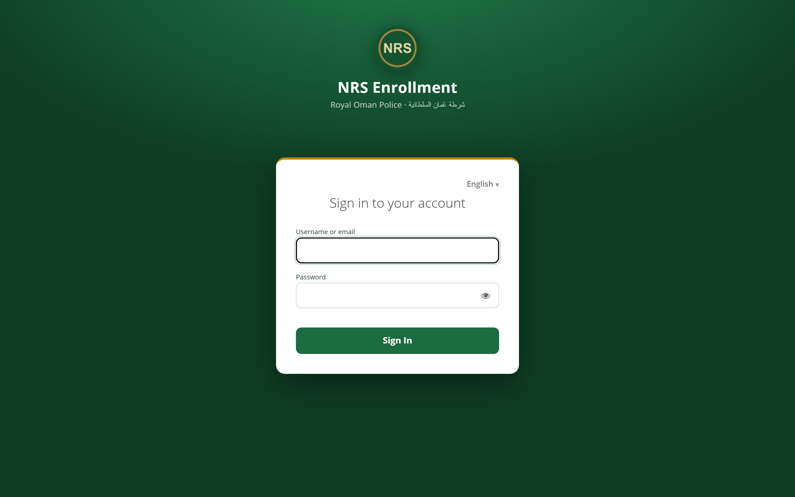

**Smart search — card results with the live quick-preview panel (English)**


**Full Arabic UI — mirrored right-to-left, Arabic name shown first**


**Applicant profile — summary, biographic details & documents**

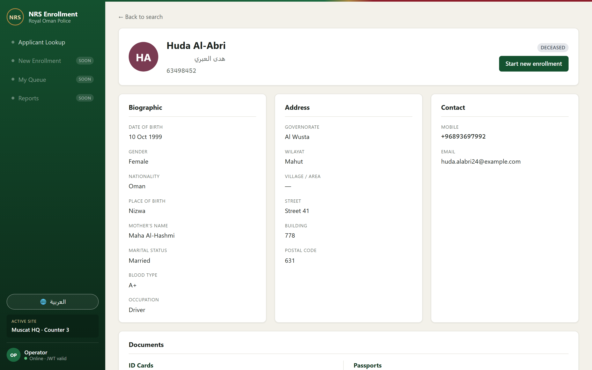

**New enrollment — bilingual create/edit form (validated, RTL Arabic)**

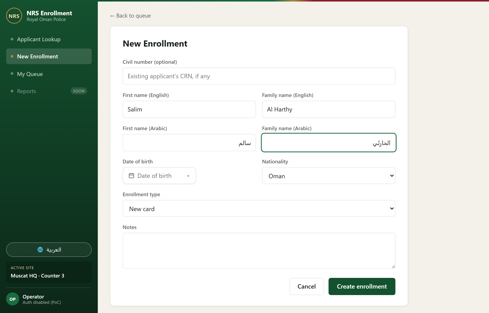

**My Queue — the operator's application register, status-tracked; a row opens the read-only detail (where a rejection's reason is shown). Decisions live on Review Tasks, not here.**

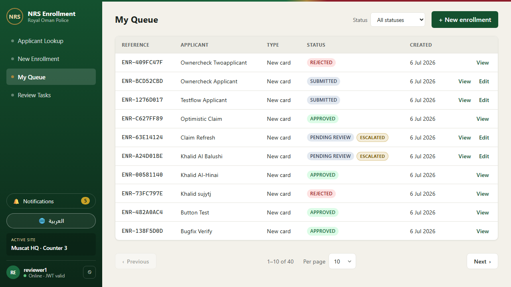

**Enrollment detail — the full application read-only: screening flags, who is handling it, and the decision outcome. A rejection shows its reason prominently, so the operator can relay it.**

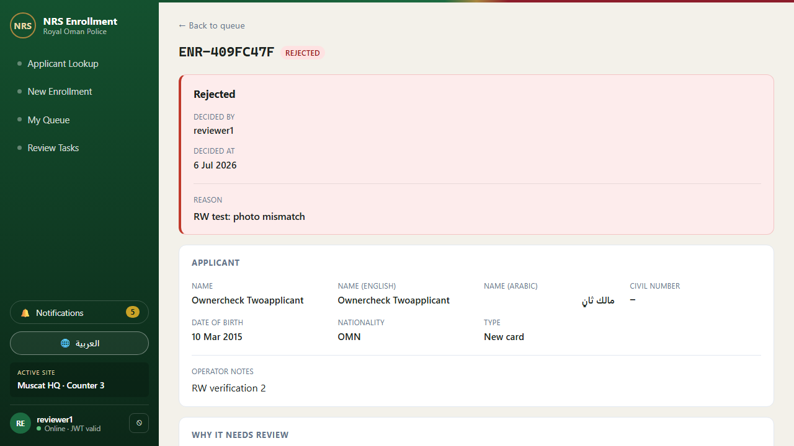

**Review Tasks — the reviewer's workspace, split into "assigned to me", "available to claim", and "with other reviewers". Claiming takes ownership (only the assignee can decide or release); screening flags explain the routing, overdue reviews carry an escalation chip, and the notification bell keeps everyone informed.**

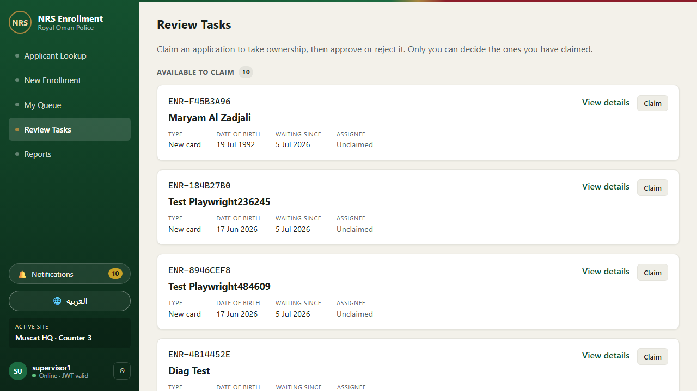

**Reports — enrollment analytics: throughput, auto-approval and approval rates, time-to-decision, SLA escalations, why applications were flagged, and reviewer workload (the in-app equivalent of a Camunda Optimize report)**

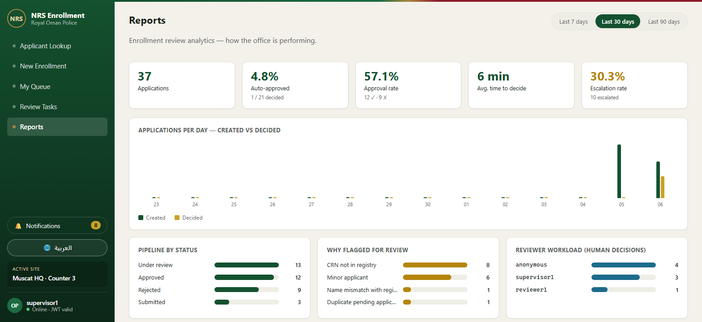

**Camunda Operate — the same review as a live BPMN process; the badge on _Await decision_ is the count of applications waiting for an operator**

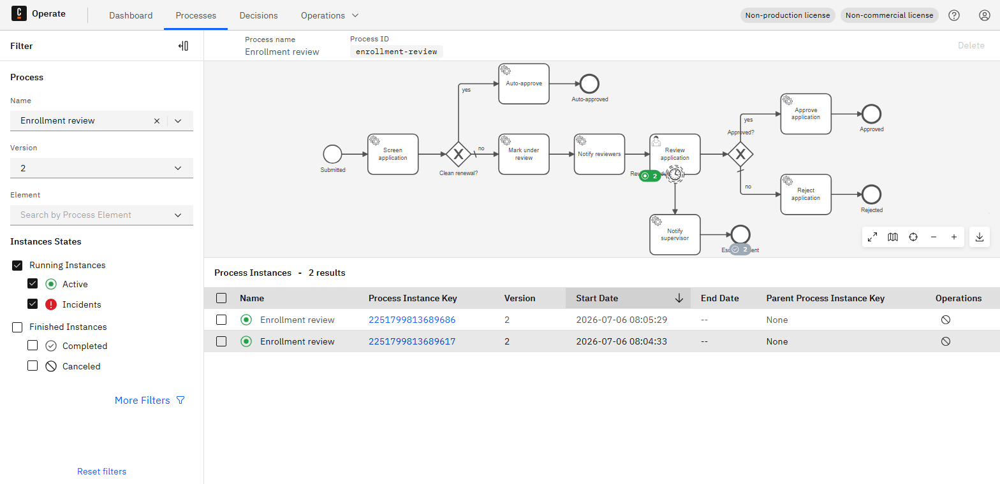

**API reference (Scalar) — every endpoint documented from the OpenAPI contract**

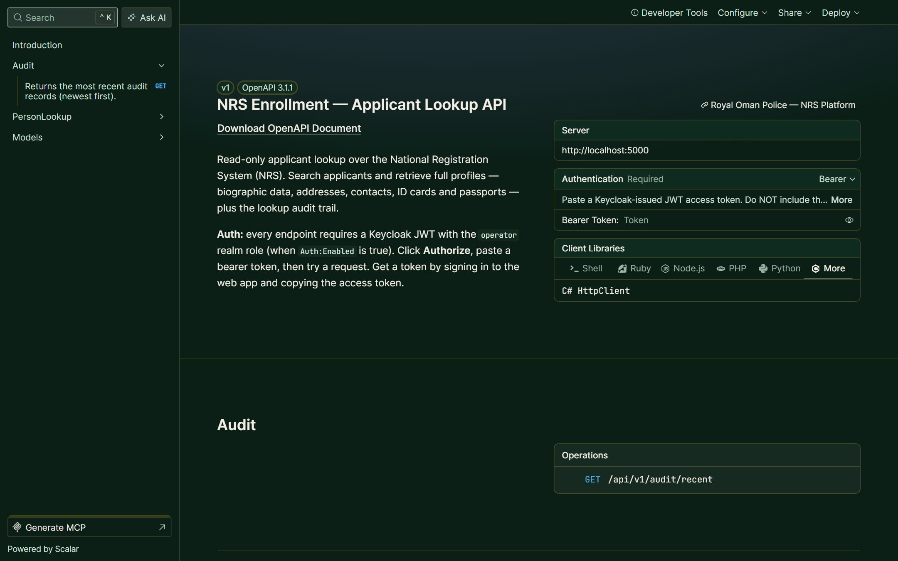

**Architecture at a glance — how the pieces communicate**

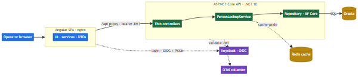

> Data is synthetic (100 generated persons). Photos are initials-avatar placeholders — no real
> people are depicted.

---

## Architecture

How the pieces talk to each other at runtime:

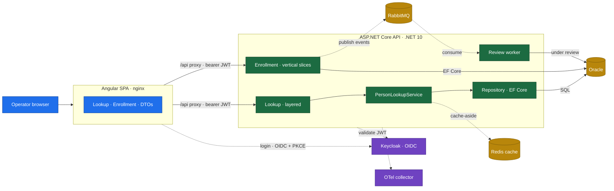

- The SPA is served by nginx, which also reverse-proxies `/api` to the backend, so the browser
  talks to a single origin (no CORS in the container stack).
- The SPA logs the operator in directly against **Keycloak** using Authorization Code + PKCE
  and attaches the resulting bearer token to every API call.
- The API **validates** each JWT against Keycloak (issuer, audience, lifetime, signing key) and
  reads from **Oracle** through EF Core, with **Redis** as a best-effort cache-aside in front of
  hot profile reads.
- OpenTelemetry is instrumented in the API; when an OTLP endpoint is configured it exports
  traces and metrics to a collector (otherwise it is a no-op).
- New **enrollment** applications are created and edited through self-contained **vertical
  slices** (minimal-API endpoints + FluentValidation using EF Core directly). On submit the API
  publishes an event to **RabbitMQ** and starts the review process.
- The review itself is an explicit **Camunda 8** BPMN process — a real human-in-the-loop
  workflow. **Automated screening** (a service task) checks the registry: a clean renewal is
  **auto-approved** in seconds (straight-through processing); anything flagged (unknown CRN,
  name mismatch, duplicate pending, minor applicant) is **queued for review** (`PENDING_REVIEW`)
  as a **reviewer user task** that appears both in the app's Review Tasks screen and in Camunda
  Tasklist. A reviewer **claims** it to take ownership (`UNDER_REVIEW`, stamped with the
  assignee) — and **only that assignee** can approve or reject it, or release it back to the
  queue. A **boundary timer** escalates overdue reviews to a supervisor, and **notification
  service tasks** keep staff informed via the in-app bell. The API is an external **job worker**:
  Camunda owns the *flow*, the app owns the *side effects* (Oracle status writes, notifications).
  Ownership lives on the enrollment row, so the queue and claim/release are DB-driven (accurate
  and lag-free); rejections require a reason, and every decision is audited (who/when/why).
  Camunda is feature-flagged: with no engine configured, decisions apply directly to the
  database — see [ADR 0006](docs/adr/0006-camunda-workflow.md) and
  [ADR 0007](docs/adr/0007-human-in-the-loop-review.md).
- A **supervisor-only Reports** dashboard turns that workflow data into operational analytics —
  throughput, straight-through (auto-approval) rate, approval/rejection rates, average
  time-to-decision, SLA-escalation rate, why applications get flagged, and per-reviewer
  workload — the in-app equivalent of a Camunda Optimize report, tailored to this process.

Clean, layered architecture with dependencies pointing **inward**
(`Api → Application → Domain`; `Infrastructure` wired at the composition root) — see
[ADR 0002](docs/adr/0002-layered-architecture.md). The
[OpenAPI contract](docs/api/openapi.yaml) is the single source of truth, enforced by contract
tests so code and spec can't drift.

### A search request, end to end

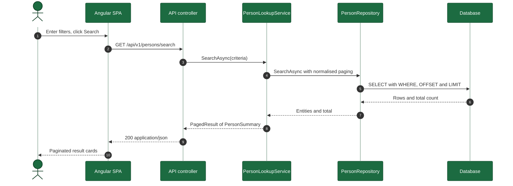

### An enrollment submission, end to end

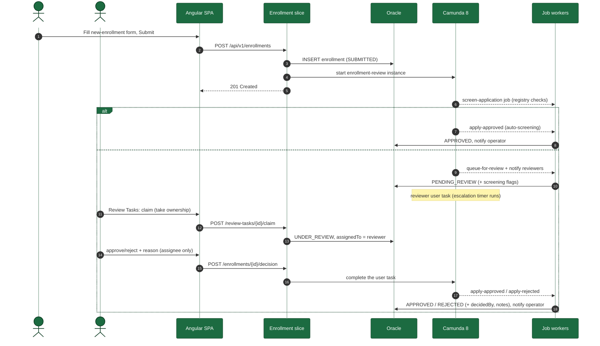

---

## Tech stack

| Layer        | Technology                                                            |
| ------------ | -------------------------------------------------------------------- |
| Frontend     | Angular 21 (standalone components, signals, reactive forms, router)  |
| Backend      | ASP.NET Core (.NET 10) — layered (lookup) + vertical slices (enrollment) |
| Data access  | Entity Framework Core (Oracle)                                       |
| Messaging    | RabbitMQ — enrollment events (best-effort, feature-flagged)          |
| Workflow     | Camunda 8 (BPMN) — screening, reviewer user tasks, SLA timers (`/v2`) |
| API docs     | OpenAPI (contract-first) rendered with Scalar                        |
| Identity     | Keycloak (OIDC / JWT) — feature-flagged                              |
| Quality      | xUnit, Playwright; unit · integration · contract · architecture · e2e |
| Platform     | Docker, GitHub Actions (CI/CD), OpenShift                            |

---

## Repository layout

```
nrs-enrollment-lookup/
├── backend/      ASP.NET Core solution (Api · Application · Domain · Infrastructure + tests)
├── frontend/     Angular 21 single-page app (+ Playwright e2e)
├── deploy/       OpenShift manifests + Keycloak realm
├── docs/         ADRs, the frozen OpenAPI contract, diagram source, screenshots, onboarding
└── .github/      CI/CD workflows and repo policy
```

The full target tree (every file tagged with its workstream) lives in
[`docs/project-structure.md`](docs/project-structure.md).

---

## Getting started

### Option A — Docker (the full production-shaped stack)

One command runs everything: Angular SPA → API on **Oracle**, with **Keycloak** login.

```bash
docker compose up --build
```

- App: **http://localhost:4200** — redirects to Keycloak to log in:

  | User | Password | Roles | Can |
  | ---- | -------- | ----- | --- |
  | `operator1` | `Operator1234` | operator | search, create/edit enrollments |
  | `reviewer1` | `Reviewer1234` | operator + reviewer | + claim and decide review tasks |
  | `supervisor1` | `Supervisor12` | operator + reviewer + supervisor | + receives SLA escalations |

- API docs (Scalar): http://localhost:5000/scalar · Keycloak admin: http://localhost:8081 (admin / admin)
- Camunda Operate + Tasklist (live BPMN instances & user tasks): http://localhost:8088 (**demo / demo**)
- Demo SLA: an unactioned review escalates to a supervisor after **2 minutes** (configurable; 48 h prod-shaped default)

First start takes a few minutes (Oracle initialises; the API waits for it, then creates the
schema and seeds 100 persons). Auth is enabled for the container SPA via a mounted
`config.json` (see `deploy/spa-config.docker.json`); the image's default is auth-off.

> If `localhost:4200` shows stale content, make sure no host `ng serve` is still bound to
> `:4200` (it shadows Docker on `localhost`). Stop it, or use Option B for host dev.

### Option B — run locally (against a local Oracle)

Prerequisites: [.NET 10 SDK](https://dotnet.microsoft.com/), [Node.js 22+](https://nodejs.org/),
and [Docker](https://www.docker.com/) (required for the local Oracle).

```bash
# 1. start a local Oracle (listens on localhost:1521/XEPDB1)
docker compose up -d oracle

# 2. backend
cd backend
dotnet run --project src/Nrs.Api          # https://localhost:7001/scalar

# 3. frontend (separate terminal)
cd frontend
npm install
npm start                                  # http://localhost:4200 (proxies /api → backend)
```

The API connects to the configured Oracle database (`localhost:1521/XEPDB1`), applies EF Core
migrations on startup, and seeds 100 persons (each with ID cards + passports) outside Production.

### API endpoints

| Method & path | Purpose |
| ------------- | ------- |
| `GET /api/v1/persons/search?crn&name&dob&nationality&page&pageSize` | Paged, multi-filter search (partial bilingual name match) |
| `GET /api/v1/persons/{crn}` | Full profile incl. ID cards + passports |
| `POST /api/v1/enrollments` · `PUT /api/v1/enrollments/{id}` | Create / edit an enrollment (starts the review workflow) |
| `GET /api/v1/enrollments?status&page&pageSize` · `GET /api/v1/enrollments/{id}` | List (queue) / fetch one enrollment |
| `POST /api/v1/enrollments/{id}/decision` | Approve / reject an enrollment you have claimed (assignee only; reason required to reject) |
| `GET /api/v1/review-tasks` · `POST /api/v1/review-tasks/{id}/claim` · `POST /api/v1/review-tasks/{id}/release` | The reviewer work queue: list, claim (take ownership), release (hand back) |
| `GET /api/v1/notifications` · `POST .../read` · `POST .../read-all` | Staff notification bell (review queued / decided / escalated) |
| `GET /api/v1/reports/enrollment-summary?days` | Enrollment analytics (supervisor role) — throughput, auto-approval/approval rates, time-to-decision, escalations, flags, reviewer workload |
| `GET /api/v1/audit/recent` | Recent audit-trail entries (operator-only) |
| `GET /health/live` · `/health/ready` · `/health` | Liveness · readiness (DB) · full health |

---

## Testing

```bash
cd backend  && dotnet test     # 115 tests across unit · integration · contract · architecture
cd frontend && npm run e2e     # 7 Playwright tests: operator journey, filters, enrollment, Arabic/RTL
```

| Suite | Count | Covers |
| ----- | ----- | ------ |
| Unit (`Nrs.Application.Tests`) | 30 | service orchestration, paging clamps, mapping, audit-safe cache decorator |
| Integration (`Nrs.Api.IntegrationTests`) | 64 | real HTTP → EF Core → Oracle (Testcontainers; auto-skip when Docker is unavailable); enrollment create/edit/list, auth/JWT, audit trail, rate limiting, correlation id, error contract, production-mode & seed-safety |
| Contract (`Nrs.Contract.Tests`) | 17 | code matches `openapi.yaml` (persons + enrollment paths, enums, DTOs) |
| Architecture (`Nrs.Architecture.Tests`) | 4 | layering rules enforced |
| E2E (Playwright) | 7 | search → profile; filters; enrollment create → queue; Start New Enrollment; Arabic/RTL |

CI runs all of these on every push/PR (plus code coverage and a vulnerable-package gate);
a separate CodeQL workflow runs SAST. CD builds and publishes container images to GHCR with a
Trivy image scan and an SPDX SBOM. (On this private repo, scan results are uploaded as build
artifacts; they would surface in the Security tab once GitHub Advanced Security is enabled.)

---

## Authentication (Keycloak) — feature-flagged

Off by default so the POC runs open. To enable: set `Auth:Enabled=true` (API) and
`environment.auth.enabled=true` (SPA) with a running Keycloak using
[`deploy/keycloak/realm-export.json`](deploy/keycloak/realm-export.json). The API then validates
the JWT on every request (except `/health`) and the SPA guards its routes and attaches the token.

---

## Production readiness

The application code is built secure-by-default, but the Docker Compose and OpenShift samples
deliberately use convenient demo values (inline passwords, open API docs). Before any
real deployment, work through [`docs/PRODUCTION_CHECKLIST.md`](docs/PRODUCTION_CHECKLIST.md) — it
covers the blockers (durable database, secrets, TLS, observability backend, distributed rate
limiting) alongside what is already hardened.

---

## Acceptance criteria (Definition of Done)

- [x] Search returns correct paged results for CRN, name (partial), DOB, nationality, and combinations.
- [x] Profile returns biographic data plus related ID cards and passports.
- [x] Angular form submits and shows paginated results; row click navigates to the profile.
- [x] Arabic and English names display; Arabic renders right-to-left.
- [x] OpenAPI documents all endpoints and they are testable in the API reference (Scalar).
- [x] Database seeded with 50+ persons (100), each with ≥1 ID card and ≥1 passport.
- [x] Code compiles, runs locally, and follows the layered architecture.

## License

[MIT](LICENSE) — proof-of-concept / educational. All data is synthetic.
