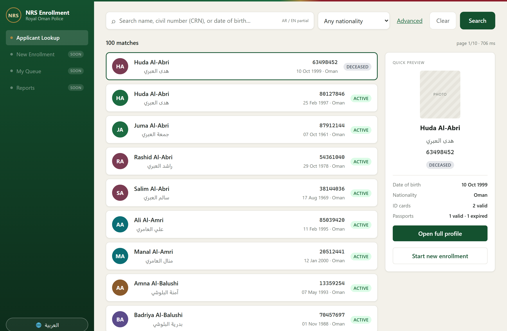
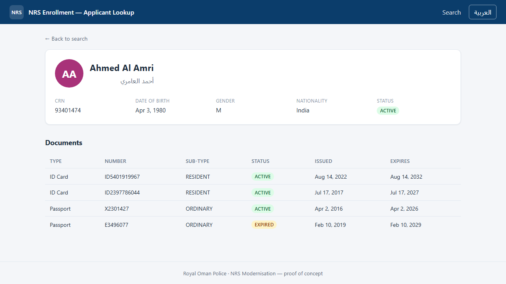
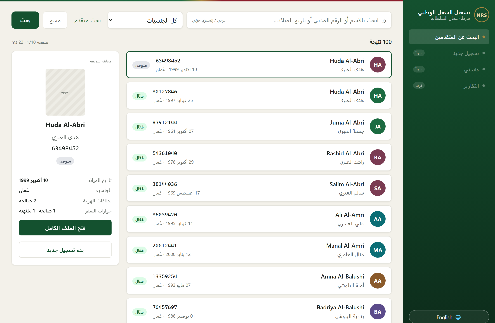
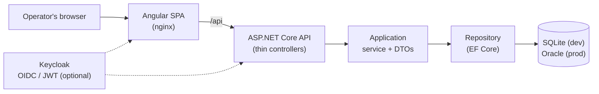

# NRS Enrollment — Applicant Lookup

[](https://github.com/Anas-Lees/nrs-enrollment-lookup/actions/workflows/ci.yml)
[](https://github.com/Anas-Lees/nrs-enrollment-lookup/actions/workflows/cd.yml)
[](LICENSE)

> Royal Oman Police · National Registration System (NRS) Modernisation
> **Enrollment track · Applicant Lookup feature** — a proof-of-concept built the way the production module will be built.

The Applicant Lookup screen is the entry point of the NRS Enrollment module. At any of the
58+ domestic sites or 75+ embassies, an operator searches for a person, opens their record,
and decides whether to start a new application or continue an existing one.

This repository delivers that feature as a clean, layered, **bilingual (Arabic / English)**,
production-shaped slice: a documented REST API over EF Core and an Angular single-page app,
with tests, containers, CI/CD and OpenShift manifests.

---

## Screenshots

**Search — results table (English)**



**Profile — summary card + documents**



**Search — full Arabic UI, right-to-left**



> Data is synthetic (100 generated persons). Photos are initials-avatar placeholders — no real
> people are depicted.

---

## Architecture



Clean, layered architecture with dependencies pointing **inward**
(`Api → Application → Domain`; `Infrastructure` wired at the composition root) — see
[ADR 0002](docs/adr/0002-layered-architecture.md). The
[OpenAPI contract](docs/api/openapi.yaml) is the single source of truth, enforced by contract
tests so code and spec can't drift.

### A search request, end to end

```mermaid
sequenceDiagram
  actor O as Operator
  participant S as Angular SPA
  participant A as API controller
  participant V as PersonLookupService
  participant R as PersonRepository
  participant DB as Database
  O->>S: enter filters, click Search
  S->>A: GET /api/v1/persons/search?…
  A->>V: SearchAsync(criteria)
  V->>R: SearchAsync (normalised paging)
  R->>DB: SELECT … WHERE … OFFSET/LIMIT
  DB-->>R: rows + count
  R-->>V: entities + total
  V-->>A: PagedResult&lt;PersonSummaryDto&gt;
  A-->>S: 200 application/json
  S-->>O: paginated results table
```

---

## Tech stack

| Layer        | Technology                                                            |
| ------------ | -------------------------------------------------------------------- |
| Frontend     | Angular 21 (standalone components, signals, reactive forms, router)  |
| Backend      | ASP.NET Core (.NET 10) — clean layered architecture                  |
| Data access  | Entity Framework Core (SQLite for dev, Oracle for prod)              |
| API docs     | Swagger / OpenAPI (contract-first)                                   |
| Identity     | Keycloak (OIDC / JWT) — feature-flagged                              |
| Quality      | xUnit, Playwright; unit · integration · contract · architecture · e2e |
| Platform     | Docker, GitHub Actions (CI/CD), OpenShift                            |

---

## Repository layout

```
nrs-enrollment-lookup/
├── backend/      ASP.NET Core solution (Api · Application · Domain · Infrastructure + tests)
├── frontend/     Angular 21 single-page app (+ Playwright e2e)
├── deploy/       OpenShift manifests + Keycloak realm
├── docs/         ADRs, the frozen OpenAPI contract, diagrams, screenshots, onboarding
└── .github/      CI/CD workflows and repo policy
```

The full target tree (every file tagged with its workstream) lives in
[`docs/project-structure.md`](docs/project-structure.md).

---

## Getting started

### Option A — Docker (the full production-shaped stack)

One command runs everything: Angular SPA → API on **Oracle**, with **Keycloak** login.

```bash
docker compose up --build
```

- App: **http://localhost:4200** — redirects to Keycloak to log in (**operator1 / operator1**)
- API/Swagger: http://localhost:5000/swagger · Keycloak admin: http://localhost:8081 (admin / admin)

First start takes a few minutes (Oracle initialises; the API waits for it, then creates the
schema and seeds 100 persons). Auth is enabled for the container SPA via a mounted
`config.json` (see `deploy/spa-config.docker.json`); the image's default is auth-off.

> If `localhost:4200` shows stale content, make sure no host `ng serve` is still bound to
> `:4200` (it shadows Docker on `localhost`). Stop it, or use Option B for host dev.

### Option B — run locally (lightweight: SQLite, no auth)

Prerequisites: [.NET 10 SDK](https://dotnet.microsoft.com/), [Node.js 22+](https://nodejs.org/).

```bash
# backend
cd backend
dotnet run --project src/Nrs.Api          # https://localhost:7001/swagger

# frontend (separate terminal)
cd frontend
npm install
npm start                                  # http://localhost:4200 (proxies /api → backend)
```

The API auto-creates and seeds a SQLite database (100 persons, each with ID cards + passports)
on first run in Development.

### API endpoints

| Method & path | Purpose |
| ------------- | ------- |
| `GET /api/v1/persons/search?crn&name&dob&nationality&page&pageSize` | Paged, multi-filter search (partial bilingual name match) |
| `GET /api/v1/persons/{crn}` | Full profile incl. ID cards + passports |
| `GET /health` | Liveness/readiness probe |

---

## Testing

```bash
cd backend  && dotnet test     # 31 tests: unit · integration · contract · architecture
cd frontend && npm run e2e     # 3 Playwright tests: the operator journey + RTL
```

| Suite | Count | Covers |
| ----- | ----- | ------ |
| Unit (`Nrs.Application.Tests`) | 8 | service orchestration, paging clamps, mapping |
| Integration (`Nrs.Api.IntegrationTests`) | 9 | real HTTP → EF Core → SQLite; seed verification |
| Contract (`Nrs.Contract.Tests`) | 10 | code matches `openapi.yaml` (paths, enums, DTOs) |
| Architecture (`Nrs.Architecture.Tests`) | 4 | layering rules enforced |
| E2E (Playwright) | 3 | search → profile journey; nationality filter; Arabic/RTL |

CI runs all of these on every push/PR; CD builds and publishes container images to GHCR.

---

## Authentication (Keycloak) — feature-flagged

Off by default so the POC runs open. To enable: set `Auth:Enabled=true` (API) and
`environment.auth.enabled=true` (SPA) with a running Keycloak using
[`deploy/keycloak/realm-export.json`](deploy/keycloak/realm-export.json). The API then validates
the JWT on every request (except `/health`) and the SPA guards its routes and attaches the token.

---

## Acceptance criteria (Definition of Done)

- [x] Search returns correct paged results for CRN, name (partial), DOB, nationality, and combinations.
- [x] Profile returns biographic data plus related ID cards and passports.
- [x] Angular form submits and shows paginated results; row click navigates to the profile.
- [x] Arabic and English names display; Arabic renders right-to-left.
- [x] Swagger documents all endpoints and they are testable there.
- [x] Database seeded with 50+ persons (100), each with ≥1 ID card and ≥1 passport.
- [x] Code compiles, runs locally, and follows the layered architecture.

## License

[MIT](LICENSE) — proof-of-concept / educational. All data is synthetic.
